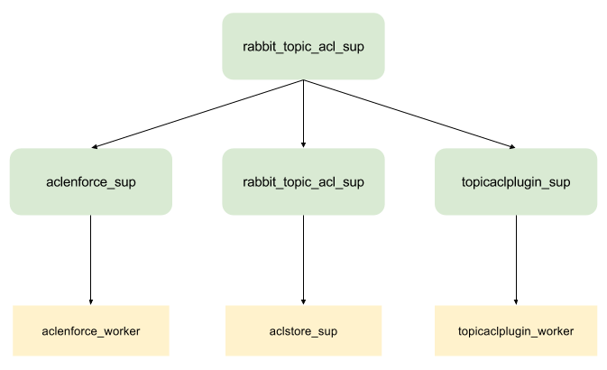

# Rabbit MQ Topic ACL Authorization plugin

## Index

* [Overview](#overview)
* [Usage](#usage)
  * [Deployment](#deployment)
  * [Administration](#administration)
  * [Configuration](#configuration)
  * [Error management](#errormanagement)
  * [Examples of use](#examples)
* [Development](#development)
  * [Internal Architecture](#architecture)
  * [Build](#build)
  * [Test](#test)

## <a name="overview"/> Overview
### Description
This project aims to provide an authorization plugin for [Rabbit MQ](https://www.rabbitmq.com/) that will manage the access to RabbitMQ resources
based on the Routing Keys used to publish and bind queues. The ultimate goal of this plugin is to be used along the
RabbitMQ MQTT plugin in order to use RabbitMQ as an MQTT broker with ACL-based authorization.

Permissions for each routing key will be defined in Access Control Lists (ACLs) with a format similar to the one used
for Mosquitto ACLs (described in the [man page of Mosquitto.conf](https://mosquitto.org/man/mosquitto-conf-5.html)).

## <a name="usage"/> Usage
### <a name="deployment"/> Deployment

In order to deploy the plugin:
- Build the packages for distribution with `make dist`.
- Move the generated `plugins/rabbitmq_topic_acl-<version>.ez` to the `plugins` directory of your RabbitMQ instance.
- Enable the plugins with the `rabbitmq-plugins` administration shell command.

Take into account that once the plugin is enabled, it will enforce the authorization rules for all the RabbitMQ transactions.

#### IMPORTANT: Side note about logging

This plugin has been developed using the `master` branch for RabbitMQ, and thus it uses the RabbitMQ mechanism for logging
in version '3.7.0', i.e.: [Lager](https://github.com/erlang-lager/lager). This approach, though, doesn't work for earlier
versions of RabbitMQ, unless an additional plugin supporting this kind of logging is installed. That plugin can be
found in [Rabbitmq-lager](https://github.com/hyperthunk/rabbitmq-lager).

In order to install the plugin:

1. Clone the repository:
```
git clone https://github.com/hyperthunk/rabbitmq-lager.git
```
2. Update the `rabbitmq-components.mq` file with the following command:
```
make rabbitmq-components-mk
```
3. Make the plugin:
```
make
make dist
```
4. Copy the plugin and its dependencies to the RabbitMQ plugins folder:
```
cp plugins/goldrush-0.1.9.ez <rabbitmq_path>/plugins/
cp plugins/lager-3.2.2.ez <rabbitmq_path>/plugins/
```
5. Enable the plugin
```
sbin/rabbitmq-plugins enable lager
```

### <a name="administration"/> Administration

Before starting to use the plugin, an ACL must be loaded in the internal RabbitMQ database (Mnesia). For all the administrative actions, the
RabbitMQ broker must be running with the plugin installed and enabled.

There are two ways of managing the ACL DB contents:
- Through the use of [ERL commands](#aclstore_commands) from the RabbitMQ Erlang console.
- Through the use of the [AMQP Administration API](#amqp_administration).

### <a name="configuration" > Configuration

The ACL Plugin can be configured through the use of environment variables. Those variables can be changed in two ways:

* Using the application file, `rabbitmq_topic_acl.app`.
* Adding an entry to the `rabbitmq.config` with name `rabbitmq_topic_acl`, as in the following example:

```
[
  {rabbit, []},
  {rabbitmq_topic_acl,
    [{acladmin, <<"journalist">>},
     {aclpassword, <<"password">>}]
  }
].
```

The following table shows the accepted variables and their meaning and default values:


| Variable            | Description                                    | Default value          |
| ------------------- |:---------------------------------------------- | ---------------------- |
| acladmin            | Name of the user that will be used as ACL administrator. This user is needed for internal processes as well as for external management| <<"guest">> |
| aclpassword         | Password for the administrator user. The password will be given in plain text. | <<"guest">> |
| exchange            | Name of the exchange that will be used in the AMQP Administration API. | <<"_topicacladmin">> |
| trashexchange       | Name of the exchange that will be declared for trashing unauthorized messages. | <<"_trash">> |
| trashqueue          | Name of the trash queue that will be used for all the unauthorized queue bindings. | <<"_trashqueue">> |

Take into account that all the strings must be declared as Erlang IO Strings (`<<"this syntax">>` instead of `"this one"`).

### <a name="errormanagement">

Following the original intention of resembling the MQTT Broker behavior, authorization management is not reported as
connection errors to the clients performing an unauthorized action. Instead of that:

* Unauthorized messages being published are redirected to a trash exchange (defined in the application environment variables).
All messages end up in the same exchange, with independence of their original destination. This exchange should, in turn
be protected using RabbitMQ standard authorization mechanisms (or exposed for client debugging in development environments).

* Unauthorized queue binds are redirected to a trash queue. No message ever arrives to that queue (at least from those
sent by the system). The queue can also be restricted or exposed depending on the environment, letting users use it for
debugging their clients.

### <a name="examples"/> Examples of use

Once the plugin is deployed and configured, and the ACL established, the plugin will start enforcing the authorizations.
The `/docs` folder contains a series of examples of use that can be used to illustrate the behavior of the RabbitMQ broker
with the activated plugin.

Some examples make use of the [RabbitMQ ACL Tool](https://github.com/dmoranj/rabbit-acl-tool) commands for testing
purposes. Check the documentation in the repository for further information.

#### Example 1

This example shows the basic behavior of the plugins for a very simple scenario: a news feed for a newspaper. The news
feed has two kinds of topics:

* `news/categories/<category>`: news channels for the different news categories offered by the newspaper. Journalists publish and
read from this resource and the general audience subscribes to the messages.
* `news/events`: private channel for the newspaper where the editor publishes events that must be covered by the journalists.
 The editor publish to this resource and the journalists read from it.

All the messages will be published to the `newsfeed` exchange.

All the files for this example can be found in the `/docs/example1` folder.

In order to setup the initial scenario, the RabbitMQ users must be created in the broker. Go to the `sbin/` folder of
your RabbitMQ instance, copy the `setupTest.sh` example script (that you can find in the `docs/example1` folder) in that
folder and execute it. This script will create three users, one for each role in
our example app: journalist, audience and editor. It also gives permissions for accessing all kind of entities in the
default VHost. Take into account that this permissions are used at a different level than the routing key permissions
offered by the plugin: this plugin does not override default RabbitMQ security, it adds a new level of security that
takes into account not only RabbitMQ resources, but also routing keys.

Once the users have been created in the RabbitMQ broker, it's time to load the ACL file. There is an example ACL file called
`newsacl` in the `/docs/example1` folder, with the permissions described in the problem description.

The file can be loaded using the RabbitMQ Erlang console. If you are testing the plugin using the `make run-broker`
build task, show the Erlang console by pressing Enter. If you are using a standalone RabbitMQ, you can issue Erlang
commands to the server through the `rabbitmqctl eval <expression>` command. In the following, we will use the latter
method (in order to use the former, just issue the expressions directly through the Erlang console).

Use the following command to show the current ACL DB contents:

```
./rabbitmqctl eval "aclstore:list_permissions()."
```

If its the first time you execute this plugin, you should see an empty array. Now, load the ACL file by using the
following command:

```
./rabbitmqctl eval "aclstore:load_permissions_file(<absolute_path_to_the_file>)."
```

Executing the permission list command again should give the following result:

```
[
{"audience",read,"news/categories/+"}
,{"editor",read,"news/categories/+"}
,{"editor",readwrite,"news/events`"}
,{"journalist",readwrite,"news/categories/+"}
,{"journalist",read,"news/events`"}
]
```

Now RabbitMQ is configured to start exchanging messages between our roles. In order to test the message interchange,
the RabbitMQ ACL Tool will be used.

In order to simulate the behavior depicted in the problem description, open two consoles and use the ACL Tool to
listen for news in `news/categories/sports` with journalist permissions in one tab and with audience permissions in
the other.

```
./acltool.js listen -U journalist -P password newsfeed "news/categories/sports"
./acltool.js listen -U audience -P password newsfeed "news/categories/sports"
```

Now, if we try publishing a piece of news using the journalist user:
```
./acltool.js publish -U journalist -P password newsfeed "news/categories/sports" "New kind of seven-winged chicken developed"
```

We should see the news appearing in both listeners. If we now try to publish with the audience user, no message
will appear in any of the listeners:
```
./acltool.js publish -U audience -P password newsfeed "news/categories/sports" "A small duck wins the Heavy Weights International Championship by points"
```
Note that no error is returned to the caller. The message is redirected to a trash exchange instead.

If we try to do the same with the `news/events` routing key:
```
./acltool.js listen -U audience -P password newsfeed "news/events"

./acltool.js listen -U journalist -P password newsfeed "news/events"
```
If we publish a events message with the editor user, we should find it in the journalist queue:
```
./acltool.js publish -U editor -P password newsfeed "news/events" "Cover the US elections"
```

The audience listener, on the other hand, doesn't get any messages in their queue, but it doesn't receive an error either.
Unauthorized queues are silently redirected to a trash queue.

#### Example 2

This example will show the previous scenario, but using MQTT instead of using AMQP for the communications. In order for
this scenario to work, a working instance of RabbitMQ with the loaded MQTT plugin will be needed. In order to check
if your RabbitMQ instance has the MQTT plugin activated, start the server and execute the following command:
```
./rabbitmq-plugins list
```
If MQTT does not appear in the list, enable it with the following command:
```
./rabbitmq-plugins enable rabbitmq_mqtt
```
The rest of the setup of the scenario works the same as in Example 1, with the on difference: when using the MQTT plugin
MQTT topic level separators, "/", are translated internally to ".". This will force us to change the ACL a little bit.
The new ACL can be found in the `newsacldot` file. Execute the rest of the setup following the previous example's instructions.

Once RabbitMQ is up and running with all the plugins, we will mimic the previous example with MQTT. To that extent, we
will use Mosquitto MQTT command-line tools to make the subscriptions and publications.

First of all, open two terminals, to listen with the `journalist` and `audience` users:
```
mosquitto_sub -u journalist -P password -t "news/categories/sports"

mosquitto_sub -u audience -P password -t "news/categories/sports"
```
If you publish with an authorized user to that topic with the following command:
```
mosquitto_pub -d -u journalist -P password -t "news/categories/sports" -m "New kind of seven-winged chicken developed"
```
You should see the message appearing in both queues. Trying to publish with the `audience` user with the exact same
command would give no error, but no message should appear in any of the queues.

If now you change the subscriptions to the `news/events` topic:
```
mosquitto_sub -u journalist -P password -t "news/events"

mosquitto_sub -u audience -P password -t "news/events"
```
And publish using the `editor` user:
```
mosquitto_pub -d -u editor -P password -t "news/events" -m "Cover the apocalypsis, please"
```
You should see that the message arrives only to the `journalist` user, as the `audience` user has no permissions in that
topic.

#### Example 3

This example will show an scenario that combines AMQP and MQTT, for both incoming and outgoing messages, including
multiple consumers for the AMQP Queues, as an example of an High Availability scenario.

The setup will be the following:

- Audience will consist of MQTT Clients, listening to the "news/categories/sports", independent of each other.
- Journalists will be AMQP consumers and producers, but, in order to split the event coverage, all of them will listen
in the same queue to the Routing Key "news/events", while publishing news to "news/categories/sports".
- The editor will be an MQTT Client, publishing coverage requests to "news/events".

User and ACL setup will be taken from the Example 2 section (refer to it for details). The first step will be to setup
the audience listeners. To do so, open two terminal windows and execute the following statement in each one:
```
mosquitto_sub -u audience -P password -t "news/categories/sports"
```

Next step consists on sending an AMQP message from the journalists to the MQTT audience listeners. Now, in other terminal,
se the following command:
```
./acltool.js publish -U journalist -p password amq.topic "news.categories.sports" "a small duck wins the heavy weights international championship by points"
```
This message should arrive to all the subscribers to that MQTT topic, so you should see the message appearing in both
audience terminals. In this command you may notice two things:

* The exchange used to publish the message was `amq.topic`. This is because that exchange is the default one used by
the MQTT plugin. Whenever a new message arrives to the MQTT port of RabbitMQ, it's rerouted to that exchange, so other
consumers wanting to interact with the MQTT API should do it through that exchange. That's also the case for queues
listening in the MQTT interface.

* The topic we used was sepparated by the `.` character, while the listeners were bound to the same topic sepparated with
the `/` character. That's because the default translation the MQTT plugin does to every routing key coming from the MQTT
plugin.

Next step is to listen to new events to cover by the journalists. In order to do so, open two new
terminals and use the following command in each one of them, to have two journalists listening to the events topic:
```
./acltool.js listen -U journalist -P password amq.topic "news.events" coverage
```
Now, we can try publishing a new event in the `news.events` topic, and the message should only arrive to one of the
journalist's queues:
```
mosquitto_pub -d -u editor -P password -t "news/events" -m "Cover the apocalypsis, please"
```
Trying multiple times, we should see how the messages are being split in a round-robin fashion between both journalists.

## <a name="development"/> Development
### Overview

### <a name="architecture"/> Internal architecture
The functionality can be coarsely divided into three groups:

- ACL Database plugin: this section groups all the modules related to ACL loading and management.
- ACL Enforcing modules: this section contains the modules related to the ACL enforcing logic.
- Authorization plugin: the RabbitMQ plugin that intercepts and authorizes the operations.

The following sections describe each group in detail.

#### ACL Database plugin

##### Overview

This group of modules provides the following features:

- ACL Store application: an application that manages the loaded ACL contents. All the information is stored in the
`aclstore_record` table in Mnesia (with disc copies). ACL entries can be added or removed dynamically through the use of the
functions provided by the `aclstore` module.

- Utility functions to load and save the current ACLs from (to) files.

- A RabbitMQ plugin listening to a private queue, to help in external ACL Administration.

##### Access Control List (ACL) Definition

Access Control Lists define the permissions that each user of the system have over different patterns of resources.
Considered abstractly, permissions in an ACL are defined by three attributes:

- A user identifier.
- A resource pattern that identifies to which resources does this rule applies. This pattern is a simple regular expression
following MQTT rules for pattern matching.
- A permission type, that can be one of read, write and readwrite.

The user identifier used in each ACL entry corresponds to the AMQP user used to connect to RabbitMQ. For anonymous
connections, the `'global'` user will be used (take into account that the `'global'` user is defined as an Erlang atom
instead of an Erlang string, so the `"global"` user could be created and will differ from the former).

For this plugin's shake, resources (represented by routing keys) will be defined as strings, possible separated by the
`/` character. Only alphanumerical characters are allowed in the routing keys. Each substring between separation characters
represents a resource level. Resource patterns are resource strings where some resource levels may be replaced by the
`+` wildcard. A resource pattern string `/level1/level2/.../levelN/#` terminated in the `#` wildcard will match with all
resources containing the prefix `/level1/level2/.../levelN/`.

The following table shows the meaning of each permission type

| Permissions         | Definition                                     |
| ------------------- |:---------------------------------------------- |
| read       	      | User can bind queues to the selected resource. |
| write       	      | User can publish messages to the selected key. |
| readwrite       	  | Combination of both read and write permissions.|

##### ACL File format

The following excerpt shows an example of an ACL file:

```
topic read #

# Topic permissions for Jack Doe user
user jackdoe
topic read root/messages
topic readwrite root/subroot/+

# Topic permissions for Jennifer Doe
user jenniferdoe
topic read root/messages
```

All the lines beginning with the `#` character are ignored as comments.

As it can be seen from the example, the files are divided into different user sections, separated by the `user <username>`
expression. For each user section, there is a list of `topic <permission> <pattern>` expressions indicating the permissions
the user have over different resource patterns.

The file starts with a list of topic expressions without a user header. Those expressions define the default permissions
for every user. Whenever a specific permission cannot be found for a user for a specific routing key, the default permissions
will be applied. Default permissions are modelled internally as corresponding to the user `'global'`.

If, after applying both the user specific and the global permissions no permissions are found, the access will be rejected.

#####  <a name="aclstore_commands"/> Permission storage

The ACL Store has been developed as a Open Telecom Platform (OTP) generic server. To ease the use of the server, a set of functions was added to
the `aclstore` module.

###### add_permission(User, Permission, Topic)

Adds a new permission to the ACL list, for the given User, and topic pattern.

###### get_permissions(User)

Gets a list of the current permissions in the ACL for the given user. Those permissions are retrieved from the user-specific
section of the ACL, i.e.: they don't include the default permissions.

Permissions are retrieved as lists of tuples containing two elements: the topic pattern and the permission for that topic.

###### list_permissions()

Retrieve a list of all the permissions in the current ACL.

Permissions are retrieved as lists of tuples containing the following elements:
- User name: the user name string (or atom in the case of `'global'`).
- Permission: atom indicating the permission (read, write or readwrite).
- Topic Pattern: the string indicating the resource pattern.

###### remove_permissions(User)

Remove all the ACL entries from the DB belonging to the given user.

###### clear_permissions()

Remove all entries from the ACL DB.

###### read_permissions_file(Filename)

Reads an ACL file, returning its contents as a list of tuples (like the one returned by the `list_permissions()` function).

###### load_permissions_file(Filename)

Reads an ACL file, loading all its contents in the database. Take into account that the ACL DB entries are not cleared as
part of the process, so all the previous entries would be kept in the new DB.

###### save_permissions_file(Filename)

Saves the current ACL DB contents to the given file.

##### <a name="amqp_administration"/> AMQP Administration API

Disclaimer: this administration API is provisional and subject to changes in the near future. In particular, the use of
routing keys to separate administration commands may be replaced by a payload based selection.

The ACL Store application listens to the private exchange `_topicacladmin` for administration commands, in order to ease
the remote ACL administration. For this queue, each administration command is received in a different routing key, having
the parameters of the command serialized in the message payload. Parameters are serialized as lists of space-separated strings
The following table shows the current allowed administration commands and their meaning and parameters:

| Command             | Parameters                          | Description                                              |
| ------------------- |:----------------------------------- |:-------------------------------------------------------- |
| add                 | <user> <permission> <topic>         | Adds a new ACL entry with the given parameters           |
| clear               |                                     | Remove all the ACL contents from the DB.                 |
| save                | filename                            | Saves the contents of the ACL to the given file.         |
| refresh             |                                     | Sends the current ACL content to the notifications topic |

Some of the commands make use of a notification topic, that can be used to synchronize administration and monitoring
systems with the contents of the ACL. This topic defaults to `notifications`.

The name of the exchange is taken in runtime from the `exchange` environment variable picked up from the application
descriptor, `rabbitmq_topic_acl.app`.

An administrative tool has been developed in a separate repository to ease the administration tasks. This administrative
tool makes use of this AMQP Administration API for all the administration tasks. It can be found in
[this repository](https://github.com/dmoranj/rabbit-acl-tool). Refer to that repository documentation for
further information.

#### ACL Enforcing modules

The `aclenforce` OTP generic server encapsulates the authorizing logic of the plugin. It exposes a single method, expose
in the `aclenforce:authorize(User, Topic, Permission)` function for convenience. This function reads the ACL entries for
the user from the DB, looking for the list of permissions the user have for the selected topic. If the list of permissions
contain the permission passed as a parameter to the `authorize/3` function, the access is granted. The access is denied
otherwise.

#### Authorization plugin

The authorization plugin itself is implemented as a RabbitMQ Interceptor Module. Two events are intercepted: `basic.publish`
(emitted whenever a client publishes a message to an exchange) and `queue.bind` (emitted whenever a client tries to bind
to a queue). Those handlers make use of the  internal function `authorize/5`, that makes use of the ACL Enforcing modules
to determine whether it should accept the operation or not. In case the operation is not accepted, a protocol error is
risen.

In order to ease the administration tasks, the plugin allows a special administrator user, that can bypass all the
authorization mechanisms (defaults to "guest").

#### Supervisor tree

The following image shows the supervisor tree of the plugin application.



As it can be seen in the image, there are three generic servers in place, each one with its own supervisor. All the
supervisores are handled, in time, by a global application supervisor.


### <a name="build"/>  Build

All the build tasks for the project are managed using Makefile (v4.0+).

The following tasks are allowed:

* `make all`: prepare all the dependencies and compile the source code.
* `make tests`: builds all the code and executes the tests under the `/test` directory.
* `make run-broker`: launches a RabbitMQ instance with the loaded plugin, for testing purposes. This task doesn't invoke
any building task, so `make all` should be executed before to ensure the plugin has been created.

* `make clean`: clean all the temporary files and generated artifacts.
* `make dist`: builds the packages to be distributed.


### <a name="test"/> Test

All the tests for the RabbitMQ Topic ACL Authorization plugin are developed with Common Tests and stored under the
`/test` folder. For each test suite requiring data files, the corresponding data folder under the tests folder was
created.

In order to execute the tests, use the following command:

```
make tests
```

The execution of the tests generate a `logs/` folder under the root folder, containing logs of the execution of all suites
as well as a web version of the execution reports.

### <a name="license"/> License

This plugin is licensed under Affero General Public License (GPL) version 3. You can find a copy of the license in the
repository root.
